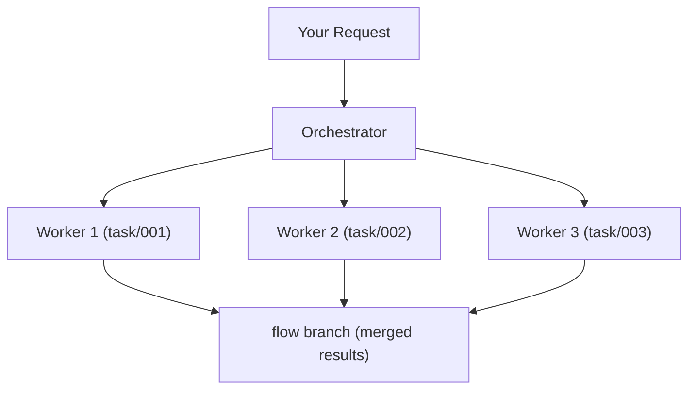

# Flow-Claude 
---

##TODO A punch line (claude code, gi)

Flow-Claude extends Claude Code with git-driven task orchestration. Break down large features into parallel subtasks, execute them simultaneously, and merge results automatically.

---

### Key feature and Benfits

Flow+Claude subagent with GitHub as the version control and information hub (sinlge source of truth).

Claude automatically generates plans and creates both plan branches and task branches:

The plan branch defines the overall workflow and updates automatically whenever a task is completed.

Each task branch is used to execute an individual task. Tasks can run in parallel using Git worktrees.

This setup ensures smooth automation, parallel task execution, and continuous synchronization between planning and execution stages.

Works seamlessly within Claude Code UI

## Related paper


## To be a conributor

submit an github issue (link) and contact team via yu.yao@sydney.edu.au and discord xxx

## Desgin Principle 

We design Flow-Claude as a lightweight tool that lives within the Claude CLI. As the Claude code model evolves, the benefits of the framework will also continue to grow. 

The framework itself should not become a blocker for future updates of the Claude model. Therefore our primary focus is communication efficiency and parallelism with minimum constraints.

Every new design should smoothly support the Claude CLI.

---
### Workflow


---

## Installation

### Prerequisites

- Python 3.10+
- Git
- Node.js 18+ (LTS recommended)
- npm 9+ or equivalent package manager
- Windows users: See [Windows Installation Guide](https://code.claude.com/docs/en/setup#windows-setup) for special instructions

> **IMPORTANT**: Claude Code must be installed first:
> ```bash
> npm install -g @anthropic-ai/claude-code
> ```
>
> See [Claude Code Setup](https://code.claude.com/docs/en/setup) for more details.

---


**Install From PyPI**
```bash
pip install flow-claude
```

**Install From Source**
```bash
git clone https://github.com/a5507203/flow-claude.git
cd flow-claude
pip install -e .
```

**Verify Installation:**
```bash
flow --help
```

Expected output:
```
Usage: flow [OPTIONS]

  Initialize Flow-Claude for Claude Code UI.

  Creates .claude/ directory structure with skills, commands, and agents.
  Run once per project, then use Claude Code UI for development.

Options:
  --help  Show this message and exit.
```

---

## Initialize Your Project

> **Warning**: For existing projects, backup your `.claude/` directory and `CLAUDE.md` first, `flow` will overwrite them.

Navigate to your git repository and initialize Flow-Claude:

### Linux / macOS

```bash
cd /path/to/your/project
flow
```

### Windows

**Option 1: Using Python Module (Works Immediately)**
```bash
cd /path/to/your/project
python -m flow_claude.commands.flow_cli
```

**Option 2: Using `flow` Command (Requires PATH Setup)**
```powershell
# Find your Python Scripts directory
python -c "import os, sys; print(os.path.join(sys.prefix, 'Scripts'))"

# Add to PATH (PowerShell - current session)
$env:PATH += ";C:\Users\YourUsername\AppData\Roaming\Python\Python3XX\Scripts"

# Or add permanently via System Environment Variables 
# Step1: Press `Win + R`
# Step2: Type `sysdm.cpl`
# Step3: Switch to `Advanced`
# Step4: Clip `Environment Variables` to add
```

Then run:
```bash
flow
```

---
**What happens during initialization:**
- Creates `flow` branch from your main branch
- Creates `.claude/` directory with skills, commands, agents
- Creates/updates `CLAUDE.md` with Flow-Claude instructions
- Commits all changes to `flow` branch

### Directory Structure
```
your-project/
├── .claude/        # Flow-Claude skills, commands, agents, settings
├── .worktrees/     # Git worktrees for worker branches (auto-created, ignored by git)
├── CLAUDE.md       # Flow-Claude instructions prepended to the repo
|-- Original Projects Content...
```
---


### Example Usage

Flow-Claude can orchestrate large features with parallel workers or keep things simple when the request is tiny.

#### Usage Workflow

```bash
# Initialize
cd my-project
flow

# Open Claude Code
claude --dangerously-skip-permissions

# Ask:
"Read the SILLs, then Build a REST API for blog posts with CRUD operations"

# Flow-Claude creates:
# - plan/session-20250121-143000 (execution plan)
# - task/001-create-post-model
# - task/002-implement-crud-service
# - task/003-create-api-endpoints
# Workers execute in parallel, merge to flow branch
```

**Flow-Claude will:**

1. **Plan** - Break the request into parallel tasks (model, CRUD service, API endpoints).
2. **Execute** - Launch workers for the ready tasks, each in its own worktree.
3. **Merge** - Merge completed task branches back into `flow` and update the plan.

#### Small Task Case

When the request is clearly a quick fix (e.g., “Update README typos” or “Bump a config flag”), the main orchestrator handles it directly instead of launching workers:

- Evaluate the request scope; if it only needs one short change, skip plan/task branch creation.
- Work directly on the `flow` branch (or a lightweight scratch branch) and apply the change.
- Report back to the user with the diff/summary just like a worker would.


### Git Branch Structure

```
main/master (production)
    ↑
flow (development base)
    ├── plan/session-* (execution plans)
    ├── task/001-*
    ├── task/002-*
    └── task/003-*
```

## Commands

| Command | Description |
|---------|-------------|
| `\auto` | Toggle autonomous mode (ON = no approval needed) |
| `\parallel N` | Set max parallel workers (1-10, default: 3) |

---

## MCP Servers and AgentSkills
The main agent can automatically determine which MCP tools and agent skills the worker agents require. 


### MCP Servers Install 

Flow-Claude uses MCP in the same way as Claude Code, except that **MCP servers must be installed inside your project directory**.

For detailed MCP setup instructions, see:
- [Claude Code MCP](https://code.claude.com/docs/en/mcp)

**Example: Adding the Playwright MCP server**

```bash
claude mcp add playwright -- npx --scope project @playwright/mcp@latest # # Run this command inside your project directory
```

Or manually add to `.mcp.json` in your project root folder:

```json
{
  "mcpServers": {
    "playwright": {
      "type": "stdio",
      "command": "npx",
      "args": ["@playwright/mcp@latest"]
    }
  }
}
```
---
### Skill Install
Flow-Claude uses Skill in the same way as Claude Code, except that **Skill must be added inside your project directory**.

For detailed Skill adding instructions, see:
- [Claude Code Skill](https://platform.claude.com/docs/en/agent-sdk/skills#how-skills-work-with-the-sdk)

**Example: Creating Skills**
- Created as `SKILL.md` files in specific directories (.claude/skills/)
```
.claude/skills/processing-pdfs/
└── SKILL.md
```
---

### Hooks Setup

Get notified when Claude needs attention or completes tasks - useful when running AI in background.

**1. Install notification script:**
```bash
npx claude-code-templates@latest --hook=automation/simple-notifications --yes
```
Then delete the `postToolUse` hook added by this command (we only need the notification script it installs).

**2. Add hooks via `/hooks` command:**

| Hook Type | Command |
|-----------|---------|
| **Stop** (task done) | `if command -v osascript >/dev/null 2>&1; then osascript -e 'display notification "Task completed successfully" with title "✅ Claude Code Done"'; elif command -v notify-send >/dev/null 2>&1; then notify-send '✅ Claude Code' 'Task completed successfully'; fi` |
| **Notification** (action needed) | `if command -v osascript >/dev/null 2>&1; then osascript -e 'display notification "Claude Code needs your input or approval!" with title "🛑 Action Required"'; elif command -v notify-send >/dev/null 2>&1; then notify-send '🛑 Claude Code' 'Action or permission required!'; fi` |

> Works on macOS (`osascript`) and Linux (`notify-send`).

---

### License

MIT License - see [LICENSE](LICENSE) for details.

### Support
- [GitHub Issues](https://github.com/a5507203/flow-claude/issues)

---

**Ready to supercharge your development?**

```bash
pip install flow-claude && cd your-project && flow
```
