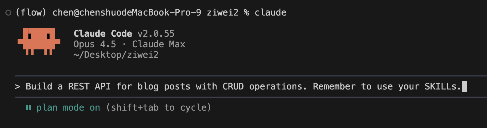
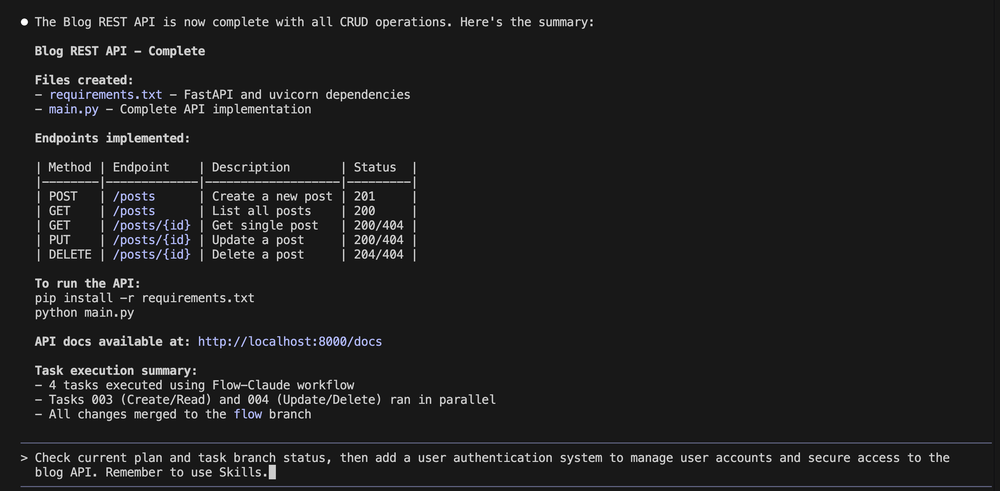
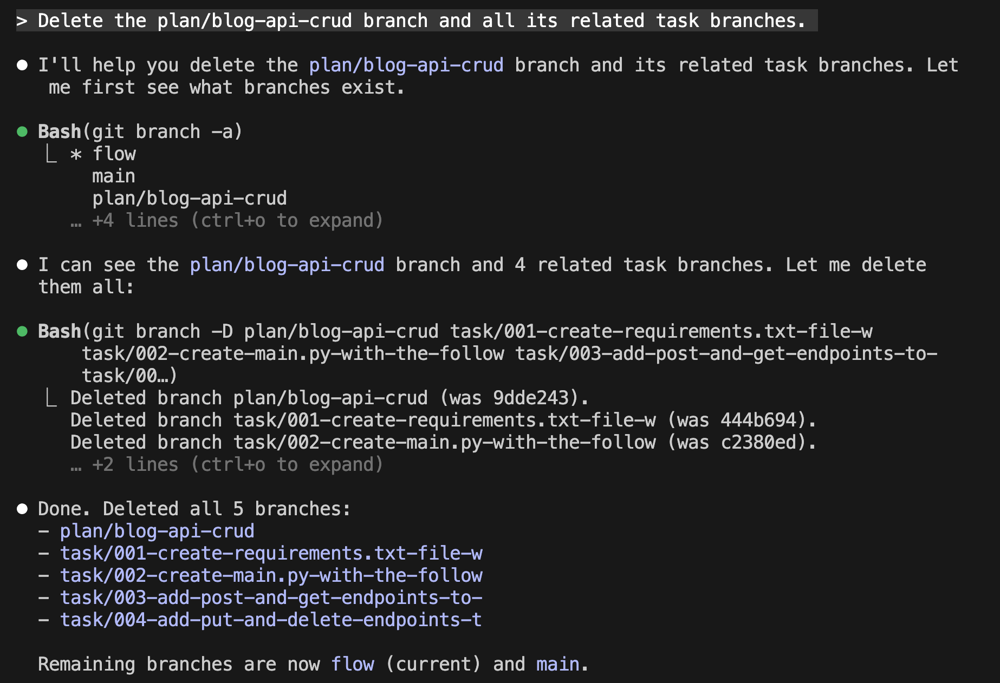

# Flow-Claude User Guide

### Initialize flow-claude in your project

```bash
cd your-project
flow
```

```
your-project/
├── .claude/                    # Flow-Claude configuration
│   ├── skills/
│   │   ├── your-workflow/     # Orchestrator workflow
│   │   ├── launch-workers/    # Worker management
│   │   └── git-tools/         # Git state operations
│   ├── agents/
│   │   ├── user.md            # User decision agent (optional)
│   │   └── worker-template.md # Worker execution template
│   ├── commands/
│   │   ├── auto.md            # \auto slash command
│   │   └── parallel.md        # \parallel slash command
│   └── settings.local.json    # Permissions & hooks
├── .worktrees/                 # Worker workspaces (auto-created)
├── CLAUDE.md                   # Project instructions for Claude
└── [your existing files]
```
### Launch Claude Code
Use command 
```bash
claude 
```
to activate the terminal cli, if you want to acvoid frequrent permission approval, use `claude --dangerously-skip-permissions`

### Prompt model to use `Flow-Claude`
In order to use flow-Claude, you must explicitly instruct the model to use them.  
Because the current Claude model does **not reliably invoke Skills automatically**, you need to **append a reminder at the end of your prompt**.
For example:
```
Build a REST API for blog posts with CRUD operations. Remember to use your SKILLs.
```


### Resume and continue your work
When you return to a project after a break or session interruption, Claude needs to understand the current state before continuing.

**Step 1:** Use the resume command to restore your previous conversation:
```
/resume
```
Select the past conversation from the list.

**Step 2:** Prompt Claude to check the current state and continue. For example:
```
Check current plan and task branch status, then add a user authentication system to manage user accounts and secure access to the blog API. Remember to use Skills.
```

This tells Claude to:
1. Scan for existing `plan/*` and `task/*` branches
2. Read the metadata files to understand progress
3. Identify incomplete or failed tasks
4. Resume work automatically based on the current state

### Delete the unwanted local branches
After a plan is finished and all tasks passed, you may want to clean up the created branches. Use a prompt like:
```
Delete the plan/<plan-name> branch and all its related task branches.
```
For example: `Delete the plan/blog-api-crud branch and all its related task branches.`

### Commit manual changes
If you make local changes on the `flow` branch and want workers to use them, commit your changes first:
```bash
git add . && git commit -m "Your commit message"
```
Workers pull from the `flow` branch, so uncommitted changes won't be visible to them.