# Flow-Claude User Guide

> **Complete documentation for Flow-Claude: Git-driven autonomous development with parallel task execution**

---

## Table of Contents

- [1. Getting Started](#1-getting-started)
  - [1.1 Introduction](#11-introduction)
  - [1.2 Prerequisites](#12-prerequisites)
  - [1.3 Installation](#13-installation)
  - [1.4 Initialize Your Project](#14-initialize-your-project)
  - [1.5 Your First Run (5-Minute Tutorial)](#15-your-first-run-5-minute-tutorial)
- [2. Core Concepts](#2-core-concepts)
  - [2.1 Architecture Overview](#21-architecture-overview)
  - [2.2 Git as Database](#22-git-as-database)
  - [2.3 Branch Structure](#23-branch-structure)
  - [2.4 Task Dependencies (DAG)](#24-task-dependencies-dag)
  - [2.5 Git Worktrees](#25-git-worktrees)
  - [2.6 Autonomous vs Approval Mode](#26-autonomous-vs-approval-mode)
- [3. Workflows](#3-workflows)
  - [3.1 Large Feature Development](#31-large-feature-development)
  - [3.2 Quick Fix (Single Task)](#32-quick-fix-single-task)
  - [3.3 Dependent Tasks](#33-dependent-tasks)
  - [3.4 Mid-Execution Replanning](#34-mid-execution-replanning)
  - [3.5 Recovering from Failures](#35-recovering-from-failures)
  - [3.6 Resuming Interrupted Sessions](#36-resuming-interrupted-sessions)
- [4. Configuration Reference](#4-configuration-reference)
  - [4.1 Directory Structure](#41-directory-structure)
  - [4.2 Autonomous Mode (`\auto`)](#42-autonomous-mode-auto)
  - [4.3 Parallel Workers (`\parallel N`)](#43-parallel-workers-parallel-n)
  - [4.4 Settings Configuration](#44-settings-configuration)
  - [4.5 CLAUDE.md Customization](#45-claudemd-customization)
  - [4.6 MCP Server Integration](#46-mcp-server-integration)
  - [4.7 Custom Skills](#47-custom-skills)
- [5. Commands Reference](#5-commands-reference)
  - [5.1 CLI Commands](#51-cli-commands)
  - [5.2 Slash Commands](#52-slash-commands)
- [6. Scripts Reference (API)](#6-scripts-reference-api)
  - [6.1 create_plan_branch.py](#61-create_plan_branchpy)
  - [6.2 create_task_branch.py](#62-create_task_branchpy)
  - [6.3 update_plan_branch.py](#63-update_plan_branchpy)
  - [6.4 read_plan_metadata.py](#64-read_plan_metadatapy)
  - [6.5 read_task_metadata.py](#65-read_task_metadatapy)
  - [6.6 parse_branch_latest_commit.py](#66-parse_branch_latest_commitpy)
  - [6.7 launch_worker.py](#67-launch_workerpy)
  - [6.8 stop_hook_handler.py](#68-stop_hook_handlerpy)
- [7. Troubleshooting](#7-troubleshooting)
  - [7.1 Installation Issues](#71-installation-issues)
  - [7.2 Permission Issues](#72-permission-issues)
  - [7.3 MCP Server Issues](#73-mcp-server-issues)
- [8. Best Practices](#8-best-practices)
  - [8.1 Task Design](#81-task-design)
  - [8.2 Request Phrasing](#82-request-phrasing)
  - [8.3 Dependency Planning](#83-dependency-planning)
  - [8.4 Git Hygiene](#84-git-hygiene)
  - [8.5 Testing Strategy](#85-testing-strategy)
  - [8.6 Code Review](#86-code-review)
  - [8.7 Production Deployment](#87-production-deployment)
- [9. Advanced Topics](#9-advanced-topics)
  - [9.1 Custom Worker Templates](#91-custom-worker-templates)
  - [9.2 Custom Orchestrator Logic](#92-custom-orchestrator-logic)
  - [9.3 Hook Configuration](#93-hook-configuration)
  - [9.4 CI/CD Integration](#94-cicd-integration)
  - [9.5 Debugging Workers](#95-debugging-workers)
  - [9.6 Performance Tuning](#96-performance-tuning)
- [10. FAQ](#10-faq)
- [11. Appendix](#11-appendix)
  - [11.1 Glossary](#111-glossary)
  - [11.2 Version History](#112-version-history)
  - [11.3 Known Limitations](#113-known-limitations)

---

## 1. Getting Started

### 1.1 Introduction

#### What is Flow-Claude?

<!-- TODO: Write 2-3 paragraphs explaining:
- Flow-Claude extends Claude Code with git-driven task orchestration
- Breaks large features into parallel subtasks executed by worker agents
- Uses Git branches as the single source of truth (no external database)
-->

#### When to Use Flow-Claude

<!-- TODO: List scenarios:
- Large features requiring multiple independent components
- Projects benefiting from parallel development
- Teams wanting complete audit trails via Git
- Complex refactoring across multiple files
-->

#### When NOT to Use Flow-Claude

<!-- TODO: List scenarios:
- Simple single-file edits
- Quick bug fixes
- Exploratory/research tasks
- Projects without Git
-->

#### Key Benefits

<!-- TODO: Bullet list:
- Parallel execution (multiple workers simultaneously)
- Git-native (all state in commits, fully recoverable)
- Autonomous operation (minimal user intervention)
- Auditable history (every decision tracked)
- Seamless Claude Code integration
-->

---

### 1.2 Prerequisites

#### Required Software

| Software | Version | Check Command | Installation |
|----------|---------|---------------|--------------|
| Python | 3.10+ | `python --version` | [python.org](https://python.org) |
| Git | 2.20+ | `git --version` | [git-scm.com](https://git-scm.com) |
| Node.js | 18+ LTS | `node --version` | [nodejs.org](https://nodejs.org) |
| npm | 9+ | `npm --version` | Included with Node.js |
| Claude Code | Latest | `claude --version` | See below |

#### Installing Claude Code

```bash
npm install -g @anthropic-ai/claude-code
```

<!-- TODO: Add link to Claude Code setup docs -->
<!-- TODO: Add Windows-specific instructions -->

#### System Requirements

<!-- TODO: Document:
- RAM requirements (recommend 8GB+)
- Disk space for worktrees
- Network access for Claude API
-->

---

### 1.3 Installation

#### Option 1: Install from PyPI (Recommended)

```bash
pip install flow-claude
```

#### Option 2: Install from Source

```bash
git clone https://github.com/a5507203/flow-claude.git
cd flow-claude
pip install -e .
```

#### Verify Installation

```bash
flow --help
```

Expected output:
```
Usage: flow [OPTIONS]

  Initialize Flow-Claude for Claude Code UI.

  Creates .claude/ directory structure with skills, commands, and agents.
  Run once per project, then use Claude Code UI for development.

Options:
  --help  Show this message and exit.
```

#### Windows-Specific Setup

<!-- TODO: Document:
- PATH configuration for Scripts directory
- PowerShell vs CMD differences
- Using python -m flow_claude.commands.flow_cli as alternative
-->

---

### 1.4 Initialize Your Project

#### Basic Initialization

```bash
cd /path/to/your/project
flow
```

#### What Gets Created

```
your-project/
├── .claude/                    # Flow-Claude configuration
│   ├── skills/
│   │   ├── your-workflow/     # Orchestrator workflow
│   │   ├── launch-workers/    # Worker management
│   │   └── git-tools/         # Git state operations
│   ├── agents/
│   │   ├── user.md            # User decision agent (optional)
│   │   └── worker-template.md # Worker execution template
│   ├── commands/
│   │   ├── auto.md            # \auto slash command
│   │   └── parallel.md        # \parallel slash command
│   └── settings.local.json    # Permissions & hooks
├── .worktrees/                 # Worker workspaces (auto-created)
├── CLAUDE.md                   # Project instructions for Claude
└── [your existing files]
```

#### Git Changes

<!-- TODO: Document:
- Creates 'flow' branch from main/master
- Commits all configuration files
- Switches to flow branch
-->

> **Warning**: Back up existing `.claude/` directory and `CLAUDE.md` before running `flow` - they will be overwritten.

---

### 1.5 Your First Run (5-Minute Tutorial)

#### Step 1: Initialize

```bash
cd your-project
flow
```

#### Step 2: Launch Claude Code

```bash
claude --dangerously-skip-permissions # Recommend !!! 
```

**Reason for use --dangerously-skip-permissions:**
Running Claude Code without this flag makes every file write, command, or network call stop for an interactive approval, which is great for safety but painfully slow for real development work. `--dangerously-skip-permissions` lets the agent run end‑to‑end flows (editing many files, running tests, creating branches, etc.) without constant prompts, so iterative coding, refactors, and “run tests, then fix, then rerun” loops stay fast and fluid—especially when Flow-Claude is spawning multiple workers and issuing lots of small tool calls.

#### Step 3: Make Your Request

```
Build a REST API for blog posts with CRUD operations, Remember to use SKILLs
```

#### Step 4: Approve Permissions & Watch Execution

Flow-Claude will request essential permissions (file editing, git operations, script execution) and then autonomously execute your task through parallel workers.

<!-- TODO: Add a simplified GIF/screenshot showing the overall flow -->

> 📖 **Want to understand the complete workflow?** See [Workflow Details](./WORKFLOW_DETAILS.md) for step-by-step permission handling and execution flow with screenshots.

#### Step 5: Review Results

```bash
git log flow --oneline -10
git diff main...flow
```

#### Example Output

<!-- TODO: Add screenshot or terminal output showing:
- Plan creation message
- Worker launch messages
- Task completion messages
- Final summary
-->

---

## 2. Core Concepts

### 2.1 Architecture Overview

#### How Flow-Claude Works

```mermaid
graph LR
    A["🙋 You:<br/>eg: Build a REST API"] --> B["🎯 Orchestrator:<br/>Break into tasks"]
    B --> C["📋 Plan:<br/>task/001, 002, 003..."]
    C --> D["⚡ Workers:<br/>Run in parallel"]
    D --> E["✅ Done:<br/>All merged to flow"]

    style A fill:#f3e5f5,stroke:#7b1fa2
    style B fill:#e3f2fd,stroke:#1976d2
    style C fill:#fff3e0,stroke:#f57c00
    style D fill:#e8f5e9,stroke:#388e3c
    style E fill:#e0f7fa,stroke:#00838f
```



> **Key Concept: DAG (Directed Acyclic Graph)**
>
> Flow-Claude organizes tasks into a DAG - a dependency graph that determines execution order:
> - **Directed**: Tasks have clear order (001 must finish before 003)
> - **Acyclic**: No circular dependencies allowed
> - **Parallel**: Independent tasks run simultaneously in "Waves"
>
> Example: Task 001 & 002 (no deps) → Wave 1 (parallel) → Task 003 (needs both) → Wave 2

#### System Architecture

```mermaid
flowchart TB
    subgraph Input["📥 INPUT"]
        User["User Request"]
    end

    subgraph Process["⚙️ PROCESSING"]
        direction TB
        Orch["Orchestrator<br/><i>Analyze → Plan → Coordinate</i>"]

        subgraph Parallel["Parallel Execution"]
            direction LR
            W1["🔨 Worker 1<br/>task/001"]
            W2["🔨 Worker 2<br/>task/002"]
            W3["🔨 Worker 3<br/>task/003"]
        end
    end

    subgraph Output["📤 OUTPUT"]
        Flow["flow branch<br/><i>All work merged here</i>"]
        Main["main branch"]
    end

    User --> Orch
    Orch --> W1 & W2 & W3
    W1 & W2 & W3 --> Flow
    Flow -.->|PR| Main

    style Input fill:#f3e5f5,stroke:#7b1fa2
    style Process fill:#e3f2fd,stroke:#1976d2
    style Parallel fill:#fff3e0,stroke:#f57c00
    style Output fill:#e8f5e9,stroke:#388e3c
```



#### Component Roles

| Component | Role | Key Responsibilities |
|-----------|------|----------------------|
| **Orchestrator** | Coordinator | Analyze requests, design task DAG, manage execution waves, monitor progress |
| **Worker** | Executor | Implement code in isolated worktree, test, commit & merge to flow |
| **Git Scripts** | State Manager | Create/read branches, store metadata, launch workers |
| **User Agent** | Decision Maker | Approve plans (optional, only in approval mode) |

#### Git Scripts Reference

| Script | Purpose |
|--------|---------|
| `create_plan_branch.py` | Create plan branch with task DAG |
| `create_task_branch.py` | Create task branches from flow |
| `launch_worker.py` | Spawn worker in isolated worktree |
| `parse_branch_latest_commit.py` | Check task progress |
| `update_plan_branch.py` | Update plan with progress |
| `stop_hook_handler.py` | Cleanup on session end |

#### Execution Flow
1. **User Request** → Orchestrator receives request
2. **Analyze** → Evaluate scope, design task DAG
3. **Create Plan** → `create_plan_branch.py` → `plan/session-*` branch
4. **Create Tasks** → `create_task_branch.py` → `task/*` branches
5. **Launch Workers** → `launch_worker.py` → spawn in worktrees
6. **Parallel Execution** → Workers implement, test, commit
7. **Monitor** → `parse_branch_latest_commit.py` → track progress
8. **Merge** → Completed tasks merge to `flow`
9. **Next Wave** → Repeat 5-8 for dependent tasks
10. **Cleanup** → Remove worktrees, report summary

---

### 2.2 Git as Database

#### Why Git for State Management?

<!-- TODO: Explain benefits:
- No external database needed
- Complete history preserved
- Fully recoverable from git log
- Natural audit trail
- Familiar tooling
-->

#### How State is Stored

| State Type | Storage Location | How to Read |
|------------|------------------|-------------|
| Execution Plan | `plan/session-*` branch commits | `git log plan/session-* --format=%B` |
| Task Metadata | `task/*` branch first commit | `git log --reverse task/* --format=%B -1` |
| Task Progress | `task/*` branch commits | `git log task/* --oneline` |
| Completed Work | `flow` branch merges | `git log flow --merges` |

#### Recovering State

```bash
# View all plans
git branch -a | grep plan/

# Read a plan's details
git log plan/session-20250101-120000 --format=%B -n 1

# View task progress
git log task/001-create-user-model --oneline
```

---

### 2.3 Branch Structure

```
main/master (production)
    ↑
flow (development base) ← All work merges here first
    │
    ├── plan/session-YYYYMMDD-HHMMSS
    │   ├── Commit 1: Initial plan (v1)
    │   ├── Commit 2: Updated plan (v2) after task completion
    │   └── Commit N: Final plan version
    │
    ├── task/001-create-user-model
    │   ├── Commit 1: Task metadata
    │   ├── Commit 2: Design commit
    │   ├── Commit 3-N: Implementation progress
    │   └── Merge commit to flow
    │
    ├── task/002-add-password-hash
    └── task/003-auth-endpoints
```

#### Branch Naming Conventions

| Branch Pattern | Purpose | Example |
|----------------|---------|---------|
| `flow` | Development base | `flow` |
| `plan/session-*` | Execution plans | `plan/session-20250115-143022` |
| `task/NNN-*` | Individual tasks | `task/001-create-user-model` |

<!-- TODO: Add more details about branch lifecycle -->

---

### 2.4 Task Dependencies

> **Recall:** DAG (Directed Acyclic Graph) determines which tasks run in parallel vs. sequentially. See [How Flow-Claude Works](#how-flow-claude-works) for the concept.

#### Example: User Authentication Feature

```
Task 001: Create User model          ─┐
                                      ├──→ Task 003: Auth endpoints
Task 002: Add password hashing       ─┘         │
                                                ↓
                                         Task 004: Auth middleware
```

**Execution Waves:**
- Wave 1: Tasks 001, 002 (no dependencies, run in parallel)
- Wave 2: Task 003 (depends on 001, 002)
- Wave 3: Task 004 (depends on 003)

#### Defining Dependencies

Tasks are defined with their dependencies in the plan:

```json
{
  "tasks": [
    {"id": "001", "description": "Create User model", "depends_on": []},
    {"id": "002", "description": "Add password hashing", "depends_on": []},
    {"id": "003", "description": "Auth endpoints", "depends_on": ["001", "002"]},
    {"id": "004", "description": "Auth middleware", "depends_on": ["003"]}
  ]
}
```

---

### 2.5 Git Worktrees

#### What are Worktrees?

<!-- TODO: Explain:
- Git feature allowing multiple working directories
- Each worker gets isolated workspace
- No interference between parallel workers
- Located in .worktrees/ directory
-->

#### Worktree Lifecycle

```
1. Worker launched    → git worktree add .worktrees/worker-1 task/001-*
2. Worker executes    → Works in .worktrees/worker-1/
3. Worker completes   → Merges to flow branch
4. Cleanup            → git worktree remove .worktrees/worker-1
```

#### Managing Worktrees Manually

```bash
# List active worktrees
git worktree list

# Remove specific worktree
git worktree remove .worktrees/worker-1

# Clean up stale worktrees
git worktree prune
```

---

### 2.6 Autonomous vs Approval Mode

#### Autonomous Mode (Default: ON)

<!-- TODO: Explain:
- Orchestrator makes all decisions independently
- No user.md agent file exists
- Fastest execution
- Best for well-defined tasks
-->

#### Approval Mode

<!-- TODO: Explain:
- User agent consulted for decisions
- user.md agent file exists in .claude/agents/
- More control over execution
- Best for critical/uncertain tasks
-->

#### Toggling Modes

```
\auto          # Toggle between modes
```

| Mode | `user.md` exists? | Behavior |
|------|-------------------|----------|
| Autonomous (ON) | No | Orchestrator decides everything |
| Approval (OFF) | Yes | User agent consulted for plans/decisions |

---

## 3. Workflows

### 3.1 Large Feature Development

#### Overview

<!-- TODO: Describe the complete flow for a large feature -->

#### Step-by-Step

<!-- TODO: Document:
1. User makes request
2. Orchestrator analyzes and creates plan
3. Plan branch created with task DAG
4. Workers launched for ready tasks
5. Progress monitoring
6. Completed tasks merged to flow
7. Next wave of tasks launched
8. Final completion
-->

#### Example: Building a REST API

```
Request: "Build a REST API for blog posts with CRUD operations"

Plan created:
├── task/001-create-post-model
├── task/002-implement-crud-service
├── task/003-create-api-endpoints
└── task/004-add-validation

Execution:
Wave 1: 001, 002 (parallel)
Wave 2: 003 (depends on 001, 002)
Wave 3: 004 (depends on 003)
```

<!-- TODO: Add terminal output example -->

---

### 3.2 Quick Fix (Single Task)

#### When Quick Fix Mode Activates

<!-- TODO: List criteria:
- Request is clearly small scope
- Single file change
- No dependencies needed
- Examples: typo fix, config change, simple bug fix
-->

#### Behavior

<!-- TODO: Explain:
- No plan/task branches created
- Orchestrator handles directly on flow branch
- Faster completion
- Same quality as worker
-->

#### Example

```
Request: "Fix the typo in README.md line 42"

Orchestrator:
- Evaluates as quick fix
- Edits directly on flow branch
- Commits change
- Reports completion
```

---

### 3.3 Dependent Tasks

#### How Dependencies Work

<!-- TODO: Explain the dependency resolution algorithm -->

#### Example: Sequential Feature

```
Request: "Add user profiles with avatar upload"

Tasks:
├── task/001-create-profile-model (no deps)
├── task/002-setup-file-storage (no deps)
├── task/003-avatar-upload-endpoint (depends: 001, 002)
└── task/004-profile-api (depends: 003)
```

<!-- TODO: Show timeline/gantt of execution -->

---

### 3.4 Mid-Execution Replanning

#### When Replanning Occurs

<!-- TODO: List scenarios:
- Worker discovers missing dependency
- Scope change during implementation
- Blocking issue found
- New requirements discovered
-->

#### How It Works

<!-- TODO: Explain:
1. Worker signals issue via commit
2. Orchestrator detects via monitoring
3. Plan updated with new tasks/changes
4. New plan version committed
5. Execution continues with updated plan
-->

#### Example

```
Original Plan (v1):
├── task/001-add-search
└── task/002-search-results-page

Worker 001 discovers: "Need Elasticsearch setup first"

Updated Plan (v2):
├── task/001-add-search (paused)
├── task/003-setup-elasticsearch (NEW)
└── task/002-search-results-page
```

---

### 3.5 Recovering from Failures

#### Worker Crash Recovery

<!-- TODO: Document:
- How to detect crashed worker
- Checking worktree state
- Manual cleanup steps
- Restarting the task
-->

```bash
# Check for stuck worktrees
git worktree list

# Remove crashed worker's worktree
git worktree remove .worktrees/worker-N --force

# View what the worker completed
git log task/XXX-name --oneline
```

#### Merge Conflict Resolution

<!-- TODO: Document:
- When conflicts occur
- Manual resolution steps
- Continuing after resolution
-->

#### Session Recovery

<!-- TODO: Document:
- Reading plan state from git
- Identifying incomplete tasks
- Resuming execution
-->

---

### 3.6 Resuming Interrupted Sessions

#### Finding Previous Session State

```bash
# List all plan branches
git branch -a | grep plan/

# Read the latest plan
git log plan/session-YYYYMMDD-HHMMSS --format=%B -n 1

# Check task completion status
git log flow --merges --oneline | grep "task/"
```

#### Manual Resume Steps

<!-- TODO: Document step-by-step resume process -->

---

## 4. Configuration Reference

### 4.1 Directory Structure

```
.claude/
├── skills/
│   ├── your-workflow/
│   │   └── SKILL.md           # Orchestrator main workflow
│   ├── launch-workers/
│   │   └── SKILL.md           # Worker spawning logic
│   └── git-tools/
│       └── SKILL.md           # Git state management
├── agents/
│   ├── user.md                # User decision agent (optional)
│   └── worker-template.md     # Worker execution template
├── commands/
│   ├── auto.md                # \auto slash command definition
│   └── parallel.md            # \parallel slash command definition
└── settings.local.json        # Permissions, hooks, MCP config
```

<!-- TODO: Explain purpose of each file -->

---

### 4.2 Autonomous Mode (`\auto`)

#### Usage

```
\auto
```

#### Behavior

| Current State | Action | Result |
|---------------|--------|--------|
| Autonomous ON | Toggle | Creates `user.md`, approval mode ON |
| Autonomous OFF | Toggle | Deletes `user.md`, autonomous mode ON |

#### Implementation

<!-- TODO: Explain that toggling creates/removes .claude/agents/user.md -->

---

### 4.3 Parallel Workers (`\parallel N`)

#### Usage

```
\parallel 5    # Set max workers to 5
\parallel 1    # Sequential execution
\parallel 10   # Maximum parallelism
```

#### Valid Range

- Minimum: 1
- Maximum: 10
- Default: 3

#### Notes

<!-- TODO: Document:
- Requires Claude Code restart to take effect
- Updates value in your-workflow SKILL.md
- Higher values = more API usage
-->

---

### 4.4 Settings Configuration

#### File: `.claude/settings.local.json`

```json
{
  "permissions": {
    // TODO: Document permission options
  },
  "hooks": {
    "postExecution": {
      // TODO: Document hook configuration
    }
  },
  "mcpServers": {
    // TODO: Document MCP server configuration
  }
}
```

<!-- TODO: Document each configuration section -->

---

### 4.5 CLAUDE.md Customization

#### Purpose

<!-- TODO: Explain:
- Project-specific instructions for Claude
- Prepended by Flow-Claude during init
- Can add custom sections
-->

#### Default Sections

<!-- TODO: Document default CLAUDE.md structure -->

#### Customization Examples

<!-- TODO: Show how to add project-specific rules -->

---

### 4.6 MCP Server Integration

#### Installation

```bash
# Add MCP server to project (must be in project directory)
claude mcp add playwright -- npx @playwright/mcp@latest
```

#### Manual Configuration

File: `.mcp.json` (project root)

```json
{
  "mcpServers": {
    "playwright": {
      "type": "stdio",
      "command": "npx",
      "args": ["@playwright/mcp@latest"]
    }
  }
}
```

#### Worker Access

<!-- TODO: Explain how workers automatically get MCP access -->

---

### 4.7 Custom Skills

#### Creating a Skill

```
.claude/skills/my-custom-skill/
└── SKILL.md
```

#### SKILL.md Format

```markdown
---
description: Short description of skill capability
---

# Skill Name

Detailed instructions for the skill...
```

<!-- TODO: Provide complete example -->

---

## 5. Commands Reference

### 5.1 CLI Commands

#### `flow`

Initialize Flow-Claude in a project.

```bash
flow [OPTIONS]
```

| Option | Description |
|--------|-------------|
| `--help` | Show help message |

<!-- TODO: Add any additional options -->

---

### 5.2 Slash Commands

#### `\auto`

Toggle autonomous mode.

```
\auto
```

<!-- TODO: Document full behavior -->

#### `\parallel N`

Set maximum parallel workers.

```
\parallel 5
```

| Argument | Description | Range |
|----------|-------------|-------|
| N | Number of parallel workers | 1-10（defaut: 5） |

<!-- TODO: Document full behavior -->

---

## 6. Scripts Reference (API)

### 6.1 create_plan_branch.py

Create an execution plan branch.

```bash
python -m flow_claude.scripts.create_plan_branch \
  --session-name="feature-name" \
  --user-request="User's original request" \
  --tasks='[{"id": "001", "description": "...", "depends_on": []}]'
```

#### Arguments

| Argument | Required | Description |
|----------|----------|-------------|
| `--session-name` | Yes | Identifier for the session |
| `--user-request` | Yes | Original user request text |
| `--tasks` | Yes | JSON array of task definitions |

#### Output

```json
{
  "success": true,
  "branch": "plan/session-20250115-143022",
  "session_name": "feature-name"
}
```

<!-- TODO: Document task JSON format in detail -->

---

### 6.2 create_task_branch.py

Create a task branch for worker execution.

```bash
python -m flow_claude.scripts.create_task_branch \
  --task-id="001" \
  --instruction="Detailed task instructions" \
  --depends-on='[]' \
  --key-files='["src/models/user.py"]'
```

#### Arguments

| Argument | Required | Description |
|----------|----------|-------------|
| `--task-id` | Yes | Task identifier (e.g., "001") |
| `--instruction` | Yes | Detailed instructions for worker |
| `--depends-on` | No | JSON array of dependency task IDs |
| `--key-files` | No | JSON array of relevant file paths |

#### Output

```json
{
  "success": true,
  "branch": "task/001-create-user-model"
}
```

---

### 6.3 update_plan_branch.py

Update plan with progress or replanning.

```bash
python -m flow_claude.scripts.update_plan_branch \
  --plan-branch="plan/session-20250115-143022" \
  --tasks='[...]' \
  --version=2
```

#### Arguments

| Argument | Required | Description |
|----------|----------|-------------|
| `--plan-branch` | Yes | Plan branch name |
| `--tasks` | Yes | Updated tasks JSON |
| `--version` | Yes | New plan version number |

<!-- TODO: Document full arguments and output -->

---

### 6.4 read_plan_metadata.py

Read plan metadata from branch.

```bash
python -m flow_claude.scripts.read_plan_metadata \
  --plan-branch="plan/session-20250115-143022"
```

#### Output

```json
{
  "success": true,
  "message": "Plan commit body content..."
}
```

---

### 6.5 read_task_metadata.py

Read task instructions from branch.

```bash
python -m flow_claude.scripts.read_task_metadata \
  --task-branch="task/001-create-user-model"
```

#### Output

```json
{
  "success": true,
  "message": "Task instruction content..."
}
```

---

### 6.6 parse_branch_latest_commit.py

Monitor worker progress by reading latest commit.

```bash
python -m flow_claude.scripts.parse_branch_latest_commit \
  --branch-name="task/001-create-user-model"
```

#### Output

```json
{
  "success": true,
  "message": "Latest commit message..."
}
```

---

### 6.7 launch_worker.py

Launch a worker agent via Claude SDK.

```bash
python -m flow_claude.scripts.launch_worker \
  --worker-id=1 \
  --task-branch="task/001-create-user-model" \
  --cwd=".worktrees/worker-1"
```

#### Arguments

| Argument | Required | Description |
|----------|----------|-------------|
| `--worker-id` | Yes | Worker identifier number |
| `--task-branch` | Yes | Task branch to work on |
| `--cwd` | Yes | Working directory (worktree path) |

<!-- TODO: Document additional arguments -->

---

### 6.8 stop_hook_handler.py

Cleanup handler for session end.

```bash
python -m flow_claude.scripts.stop_hook_handler
```

#### Behavior

<!-- TODO: Document:
- Triggered as post-execution hook
- Removes orphan worktrees
- Cleans up temporary files
-->

---

## 7. Troubleshooting

### 7.1 Installation Issues

#### `flow` command not found

**Cause**: Python Scripts directory not in PATH

**Solution (Windows)**:
```powershell
# Find Scripts directory
python -c "import os, sys; print(os.path.join(sys.prefix, 'Scripts'))"

# Add to PATH or use:
python -m flow_claude.commands.flow_cli
```

**Solution (Linux/macOS)**:
```bash
# Check if ~/.local/bin is in PATH
echo $PATH | grep -q "$HOME/.local/bin" || export PATH="$HOME/.local/bin:$PATH"
```

#### pip install fails

**Solution:** Install from source instead:

```bash
git clone https://github.com/a5507203/flow-claude.git
cd flow-claude
pip install -e .
```

**Common errors:**
- `ModuleNotFoundError` → Run `pip install -e .` again
- Permission denied → Use `pip install --user -e .` or virtual environment

---

### 7.2 Permission Issues

#### `--dangerously-skip-permissions` explained

**Why it's needed for Flow-Claude:**
- Workers execute many file operations, git commands, and Python scripts
- Each operation would require manual approval without this flag
- Parallel execution would be blocked by approval prompts

**What it bypasses:**
- File read/write confirmations
- Bash command approvals
- Git operations (commit, merge, branch)
- Python script execution

**Security considerations:**
- Only use in trusted development environments
- Review generated code before merging to main
- Don't use with untrusted repositories

**Alternative - Pre-approve specific commands:**

Add to `.claude/settings.local.json`:
```json
{
  "permissions": {
    "allow": [
      "Bash(python -m flow_claude.*)",
      "Bash(git *)",
      "Read(*)",
      "Write(*)"
    ]
  }
}
```
---

### 7.3 MCP Server Issues

#### MCP server not connecting

**Solution:** Install MCP servers at project level with `--scope project`:

```bash
# Install Playwright MCP at project level
claude mcp add playwright --scope project -- npx @playwright/mcp@latest

# Verify installation
claude mcp list
```

#### Workers can't access MCP

**Cause:** MCP servers installed at user level are not accessible to workers.

**Solution:** Install at project level or configure in `.mcp.json`:

**Option 1: CLI installation (recommended)**
```bash
claude mcp add playwright --scope project -- npx @playwright/mcp@latest
```

**Option 2: Manual configuration**

Create/edit `.mcp.json` in project root:
```json
{
  "mcpServers": {
    "playwright": {
      "type": "stdio",
      "command": "npx",
      "args": ["@playwright/mcp@latest"]
    }
  }
}
```

**Verify workers can access MCP:**
```bash
# Check .mcp.json exists
cat .mcp.json

# Test MCP connection
claude mcp list
```

---

## 8. Best Practices

### 8.1 Task Design

#### Optimal Task Granularity

<!-- TODO: Document the ~10 minute rule -->

**Good task examples**:
- "Create User model with email and password fields"
- "Implement password hashing utility"
- "Add login endpoint with JWT response"

**Bad task examples**:
- "Build entire authentication system" (too broad)
- "Fix typo" (too small, use quick fix)
- "Refactor everything" (undefined scope)

#### Task Independence

<!-- TODO: Explain how to maximize parallelism by designing independent tasks -->

---

### 8.2 Request Phrasing

#### Effective Requests

<!-- TODO: Document how to phrase requests for best results -->

**Good**:
```
Build a REST API for blog posts with:
- Post model (title, content, author, timestamps)
- CRUD endpoints
- Input validation
- Error handling
```

**Less effective**:
```
Make a blog
```

---

### 8.3 Dependency Planning

#### Maximizing Parallelism

<!-- TODO: Explain dependency strategies -->

#### Avoiding Bottlenecks

<!-- TODO: Document anti-patterns -->

---

### 8.4 Git Hygiene

#### Branch Cleanup

```bash
# After successful merge to main
git branch -d flow
git push origin --delete plan/session-*
git push origin --delete task/*
```

#### When to Prune

<!-- TODO: Document cleanup timing -->

---

### 8.5 Testing Strategy

#### Worker Testing

<!-- TODO: Document how workers should test -->

#### Integration Testing

<!-- TODO: Document post-merge testing -->

---

### 8.6 Code Review

#### Reviewing Worker Output

<!-- TODO: Document review process -->

```bash
# Review all changes
git diff main...flow

# Review specific task
git log task/001-name --oneline -p
```

---

### 8.7 Production Deployment

#### Merging to Main

```bash
# Ensure flow is complete
git checkout main
git merge flow --no-ff -m "Merge feature: description"
git push origin main
```

#### Pre-merge Checklist

<!-- TODO: Document checklist -->

- [ ] All tasks completed
- [ ] Tests passing
- [ ] Code reviewed
- [ ] No merge conflicts

---

## 9. Advanced Topics

### 9.1 Custom Worker Templates

#### Modifying Worker Behavior

File: `.claude/agents/worker-template.md`

<!-- TODO: Document customization options -->

---

### 9.2 Custom Orchestrator Logic

#### Extending the Orchestrator

File: `.claude/skills/your-workflow/SKILL.md`

<!-- TODO: Document customization options -->

---

### 9.3 Hook Configuration

#### Two Most Useful Hooks: Stop & Notification

**Workaround**: I like to watch movies and series while AI runs in background. To make sure it never stops without me noticing, I use these two hooks.

#### Setup Notification Script

First, install the notification helper:

```bash
npx claude-code-templates@latest --hook=automation/simple-notifications --yes
```

Then delete the hook added by above command (found in `postToolUse` hook). We're deleting this hook because it's not useful to us, but the notification script it added is needed for further work.

#### Adding the Hooks

1. Open Claude Code CLI or terminal
2. Type the slash command: `/hooks`
3. Choose **Add a new hook**

#### Stop Hook (Task Completed)

**Event type**: `Stop`

**Command**:
```bash
if command -v osascript >/dev/null 2>&1; then osascript -e 'display notification "Task completed successfully" with title "✅ Claude Code Done"'; elif command -v notify-send >/dev/null 2>&1; then notify-send '✅ Claude Code' 'Task completed successfully'; fi
```

#### Notification Hook (Action Required)

**Event type**: `Notification`

**Command**:
```bash
if command -v osascript >/dev/null 2>&1; then osascript -e 'display notification "Claude Code needs your input or approval!" with title "🛑 Action Required"'; elif command -v notify-send >/dev/null 2>&1; then notify-send '🛑 Claude Code' 'Action or permission required!'; fi
```

| Hook | Triggers When | Notification |
|------|---------------|--------------|
| Stop | Session ends | "Task completed successfully" |
| Notification | Needs user input | "Action or permission required!" |

> **Note**: `osascript` works on macOS, `notify-send` works on Linux.

---

### 9.5 Debugging Workers

#### Viewing Worker Logs

<!-- TODO: Document logging and debugging -->

#### Inspecting Worktrees

```bash
cd .worktrees/worker-1
git log --oneline -10
git status
```
---

## 10. FAQ

### General

**Q: Can I use Flow-Claude with an existing Claude Code project?**

<!-- TODO: Answer -->

**Q: Does Flow-Claude work offline?**

<!-- TODO: Answer -->

**Q: How much does parallel execution cost in API credits?**

<!-- TODO: Answer -->

### Compatibility

**Q: Does it work on Windows?**

<!-- TODO: Answer with Windows-specific notes -->

**Q: What Git versions are supported?**

<!-- TODO: Answer -->

**Q: Can I use with other AI coding assistants?**

<!-- TODO: Answer -->

### Limits & Performance

**Q: What's the maximum number of parallel workers?**

A: 10 workers maximum, configurable via `\parallel N`.

**Q: How long can a session run?**

<!-- TODO: Answer -->

**Q: What happens if my machine crashes mid-execution?**

<!-- TODO: Answer about recovery -->

### Security

**Q: Why is `--dangerously-skip-permissions` required?**

<!-- TODO: Answer -->

**Q: Is my code sent to external servers?**

<!-- TODO: Answer about data flow -->

### Troubleshooting

**Q: Why are my workers not starting?**

<!-- TODO: Answer -->

**Q: How do I cancel a running session?**

<!-- TODO: Answer -->

---

## 11. Appendix

### 11.1 Glossary

| Term | Definition |
|------|------------|
| **Orchestrator** | Main coordinator that analyzes requests, creates plans, and manages workers |
| **Worker** | Independent agent that executes a single task in an isolated worktree |
| **User Agent** | Optional decision-making agent consulted in approval mode |
| **DAG** | Directed Acyclic Graph - defines task dependencies |
| **Worktree** | Git feature providing isolated working directory for parallel execution |
| **Plan Branch** | Branch storing execution plan metadata (`plan/session-*`) |
| **Task Branch** | Branch for individual task execution (`task/NNN-*`) |
| **Flow Branch** | Development base branch where all completed work merges |
| **Session** | Single execution of a user request from plan to completion |
| **Wave** | Group of tasks with satisfied dependencies that can run in parallel |

<!-- TODO: Add more terms -->

---

### 11.2 Version History

| Version | Date | Changes |
|---------|------|---------|
| 0.1.0 | 2025-XX-XX | Initial release |

<!-- TODO: Maintain changelog -->

---

### 11.3 Known Limitations

<!-- TODO: Document current limitations -->

- Maximum 10 parallel workers
- Requires `--dangerously-skip-permissions` flag
- MCP servers must be installed per-project
- Windows requires additional PATH configuration

---

## Contributing

<!-- TODO: Add contributing guidelines or link -->

See [GitHub Issues](https://github.com/a5507203/flow-claude/issues) for reporting bugs or requesting features.

## License

MIT License - see [LICENSE](LICENSE) for details.

---

**Need help?** Open an issue at [github.com/a5507203/flow-claude/issues](https://github.com/a5507203/flow-claude/issues)
