# Flow-Claude Workflow Details

> Step-by-step guide to using Flow-Claude with screenshots

---

## Table of Contents

- [Step 1: Make Your Request](#step-1-make-your-request)
- [Step 2: Initialize Skills](#step-2-initialize-skills)
- [Step 3: Plan Creation](#step-3-plan-creation)
- [Step 4: Enable Bypass Permission Mode](#step-4-enable-bypass-permission-mode)
- [Step 5: Watch Flow-Claude Execute](#step-5-watch-flow-claude-execute)
  - [5.1 Workers Initialization](#51-workers-initialization)
  - [5.2 Task Branch Creation](#52-task-branch-creation)
  - [5.3 Parallel Execution](#53-parallel-execution)
  - [5.4 Worker Completion & Waiting](#54-worker-completion--waiting)
  - [5.5 Verification & Cleanup](#55-verification--cleanup)
  - [5.6 Final Summary](#56-final-summary)

---

## Step 1: Make Your Request

Enter your development request in Claude Code. For complex features, use **Plan Mode** and remember to mention **Skills** to activate Flow-Claude's orchestration.

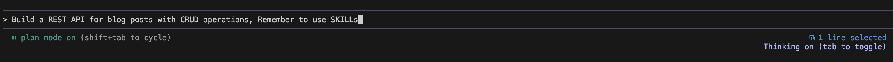

**Tips:**
- Use Plan Mode for multi-step features
- Mention `Skills` to activate Flow-Claude orchestration
- Be specific about what you want to build

**Example request:**
```
Build a REST API for blog posts with CRUD operations. Remember to use Skills.
```

---

## Step 2: Initialize Skills

Flow-Claude will initialize its skills (orchestrator, git-tools, launch-workers) to prepare for task execution.

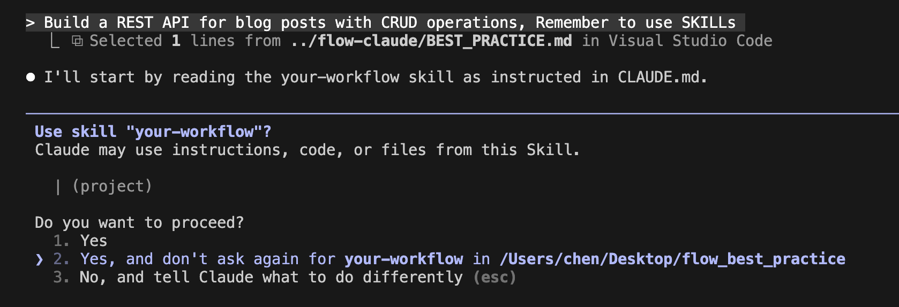

**What happens:**
- `your-workflow` skill loads the orchestrator
- `git-tools` skill provides branch management
- `launch-workers` skill enables parallel execution

---

## Step 3: Plan Creation

The orchestrator analyzes your request and creates a detailed execution plan with task breakdown (DAG).

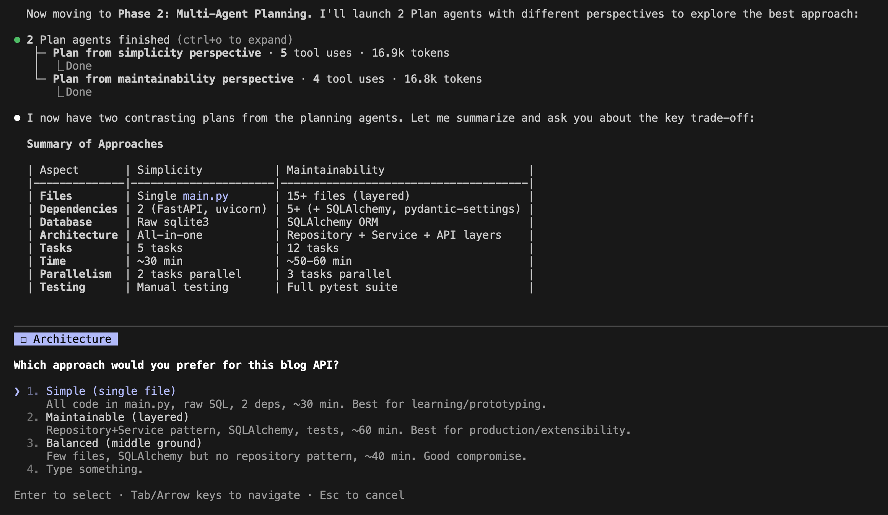

**What happens:**
1. Orchestrator analyzes scope and complexity
2. Designs task dependency graph (DAG)
3. Creates `plan/session-YYYYMMDD-HHMMSS` branch
4. Commits plan metadata with all task definitions

**Plan structure example:**
```
Plan: Build REST API for blog posts
├── task/001-create-post-model (no deps)
├── task/002-implement-crud-service (no deps)
├── task/003-create-api-endpoints (depends: 001, 002)
└── task/004-add-validation (depends: 003)
```

---

## Step 4: Enable Bypass Permission Mode

Before execution begins, switch to bypass permission mode to allow uninterrupted parallel execution.

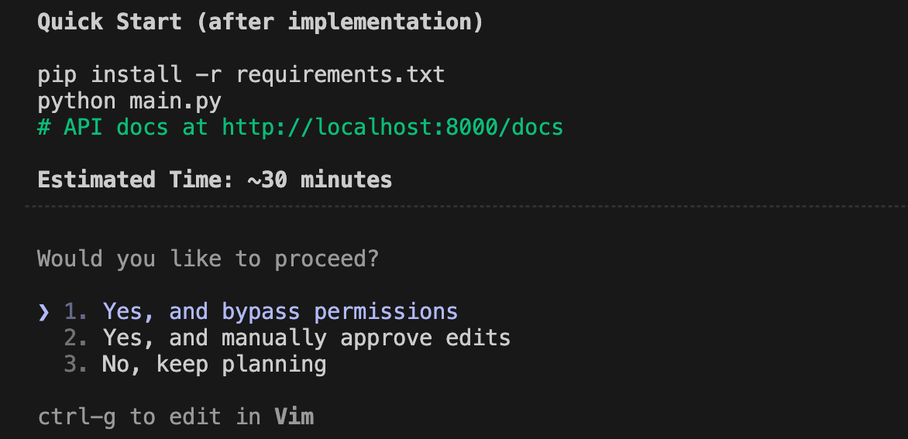

**Why this is needed:**
- Workers make many file operations and git commands
- Approval prompts would block parallel execution
- Enables smooth end-to-end automation

**Alternative:** Start Claude Code with `--dangerously-skip-permissions` flag.

---

## Step 5: Watch Flow-Claude Execute

### 5.1 Workers Initialization

Flow-Claude creates multiple workers and allocates parallelizable tasks to each worker.

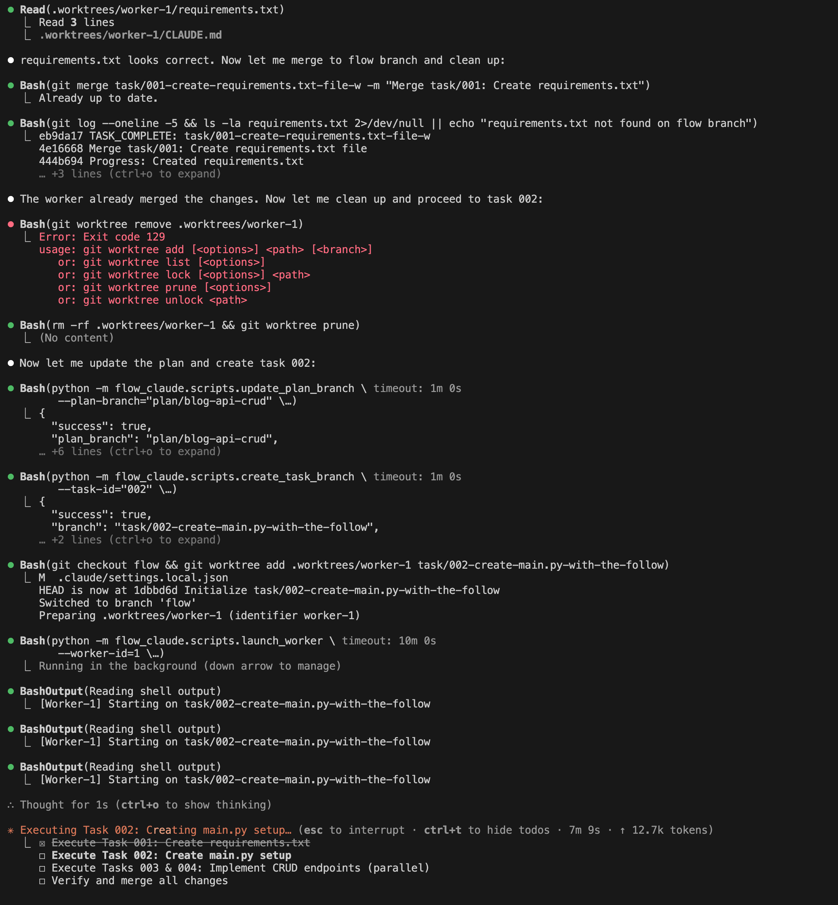

**What happens:**
- Orchestrator identifies tasks with no unmet dependencies
- Creates git worktrees for isolation (`.worktrees/worker-N/`)
- Spawns worker agents via `launch_worker.py`
- Each worker operates in its own isolated workspace

**Example output:**
```
Launching Wave 1 with 2 parallel workers...

[Worker 1] Initialized
           Task: task/001-create-post-model
           Worktree: .worktrees/worker-1

[Worker 2] Initialized
           Task: task/002-implement-crud-service
           Worktree: .worktrees/worker-2
```

---

### 5.2 Task Branch Creation

Each worker gets its own task branch created from the `flow` branch.

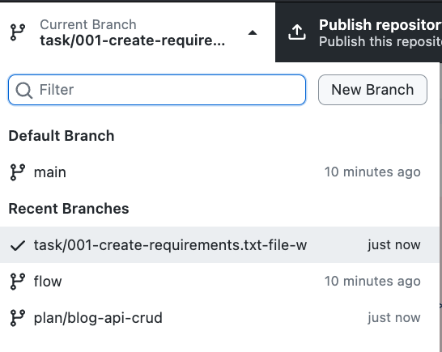

**What happens:**
1. Task branch `task/001-create-requirement.txt-file-w` created
2. Worker implements the task in isolated branch
3. Upon completion, branch is merged back to `flow`
4. Next task `task/002-create-main.py-with-the-follow` starts executing

**Branch lifecycle:**
```
flow
├── task/001-* (created → implemented → merged)
├── task/002-* (created → implementing...)
└── ...
```

---

### 5.3 Parallel Execution

Multiple workers execute their tasks simultaneously in parallel.

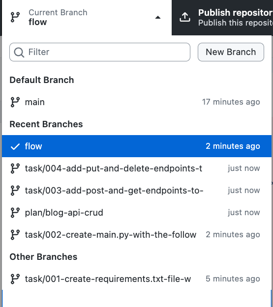

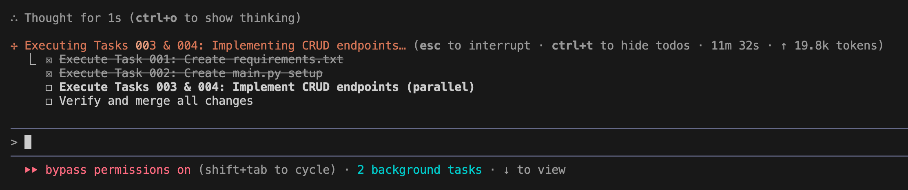

**What happens:**
- Remaining tasks distributed across available workers
- Each worker operates independently in its worktree
- No interference between parallel workers
- Orchestrator monitors all worker progress

**Parallel execution example:**
```
[Worker 1] Implementing task/003-...
[Worker 2] Implementing task/004-...
[Worker 3] Implementing task/005-...
           ↓ Running in parallel ↓
```

---

### 5.4 Worker Completion & Waiting

When a worker completes its task, it waits for other workers to finish.

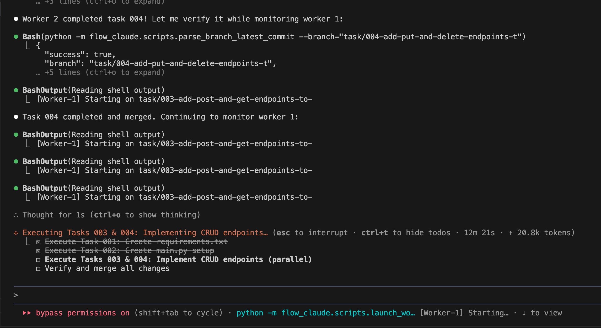

**What happens:**
- Worker commits final changes to task branch
- Merges completed work to `flow` branch
- Worker enters waiting state
- Orchestrator checks if all workers are done

---

### 5.5 Verification & Cleanup

Once all workers complete, Flow-Claude verifies the work and cleans up worker history.

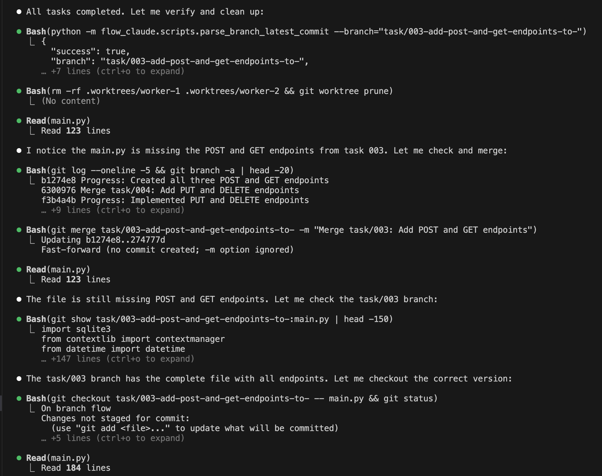

**What happens:**
1. All task branches verified as merged
2. Worktrees removed (`.worktrees/worker-N/`)
3. Worker processes terminated
4. Git state cleaned up

**Cleanup commands executed:**
```bash
git worktree remove .worktrees/worker-1
git worktree remove .worktrees/worker-2
git worktree prune
```

---

### 5.6 Final Summary

Flow-Claude outputs a summary of completed work with usage statistics.

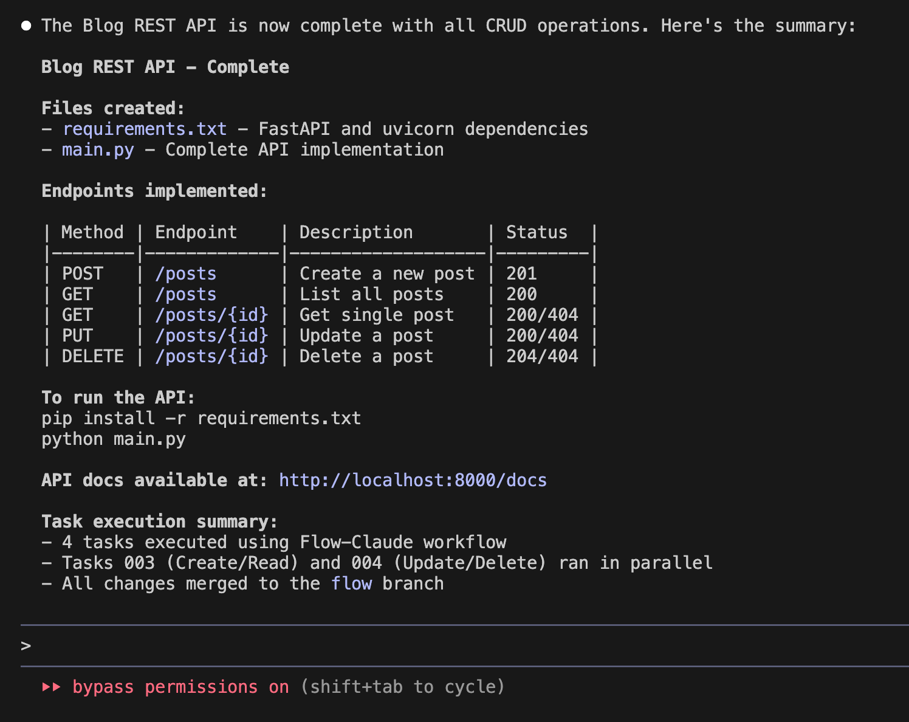

**Summary includes:**
- Total tasks completed
- Execution waves used
- Files created/modified
- Token/API usage statistics
- Command to review changes

**Example output:**
```
All tasks complete!

Summary:
├── 5 tasks completed
├── 3 waves executed
├── 12 files modified
├── Total tokens: 45,230
└── All changes merged to 'flow' branch

Review your changes:
  git diff main...flow
  git log flow --oneline -10
```

---

## Next Steps

After Flow-Claude completes:

1. **Review changes:**
   ```bash
   git diff main...flow
   ```

2. **Run tests:**
   ```bash
   npm test  # or your test command
   ```

3. **Merge to main:**
   ```bash
   git checkout main
   git merge flow
   ```

---

## Need Help?

- Back to [Quick Start Guide](./USER_GUIDE.md#15-your-first-run-5-minute-tutorial)
- [Troubleshooting](../BEST_PRACTICE.md#7-troubleshooting)
- [GitHub Issues](https://github.com/a5507203/flow-claude/issues)

---

## TODO: Screenshots Needed

The following screenshots need to be captured for a complete workflow documentation:

- [ ] **Step 2 - Skills Loading**: Need a cleaner screenshot showing skills initialization without the tech stack selection prompt (current workflow-3.png shows skill running but also includes unrelated prompts)
- [ ] **Step 5.1 - Workers Initialization**: Need a screenshot showing the initial worker spawning output (current workflow-8.png shows mid-execution details rather than clean initialization)
